# Test Plan: Guest Checkout with Cash on Delivery

**Author:** Ahmet Gjinofci
**Date:** 02.09.2026
**Application under test:** Shopware 6 storefront (Demo Shop - solution25)
**Environment:** https://www.shopware6-demo.development-s25.com/
**Browser:** Chrome 152 on macOS Tahoe 26.6.2
**Viewport:** 1440 x 900

## Scope

This plan covers the core purchase flow for a visitor who is not logged in:
finding a product, adding it to the cart, and completing checkout using
"Cash on delivery" (Nachnahme) as the payment method.

In scope: product discovery, cart, guest checkout form, payment method
selection, order confirmation.

Out of scope: registered customer accounts, the Invoice payment method,
shipping cost rules, order confirmation emails (no mailbox access on the shared
demo instance), the admin panel.

## Execution summary

All eleven cases were executed manually against the demo store on 02.09.2026.
A screenshot for each case is linked in the case itself and stored in
`screenshots/`.

| Result                               | Cases                                |
| ------------------------------------ | ------------------------------------ |
| Passed                               | 10                                   |
| Failed                               | 1 (TC-E-01)                          |
| Passed with a defect in presentation | 1 (TC-E-02, counted above as passed) |

Two defects were raised from this run: **BUG-001** from TC-E-01 and **BUG-002**
from TC-E-02. Both are in [`bug-report.md`](bug-report.md).

## Environment notes

Several things about this storefront affect how the cases below are written.

- **The storefront serves German content**, despite the HTML declaring
  `lang="en-GB"`. Labels are German (Warenkorb, Anzahl, Zur Kasse, Weiter,
  Zahlungspflichtig bestellen) while the main navigation and some order
  confirmation pages render in English. The language is not consistent between
  pages or between sessions, so the cases below name buttons in the language
  observed at the time.
- **Guest checkout is not a separate step.** The checkout form has a
  "Kundenkonto anlegen" checkbox which is **ticked by default**. It must be
  unticked to check out as a guest. Doing so changes which fields are rendered.
- **The catalogue is small and custom**, not Shopware's standard demo data.
  Products observed: Demo Produkt (SW10001), Variant product (SW10002.1),
  Westin Test 12cm (SW10003.x). Cases refer to any available product except
  where a specific one is named.
- **Cash on delivery is available** but is not the default. Invoice is
  preselected on the confirmation page, so selecting Nachnahme is a required
  step rather than an optional one.
- The demo store is shared, so its data can change between runs.

## Priority definitions

| Priority | Meaning                                                              |
| -------- | -------------------------------------------------------------------- |
| High     | Blocks purchase. A failure here means no revenue.                    |
| Medium   | Degrades the flow but a determined user can still complete an order. |
| Low      | Cosmetic or rare-path issue.                                         |

---

## Positive test cases

### TC-P-01 — Complete guest checkout with Cash on delivery

| Field             | Value                                                |
| ----------------- | ---------------------------------------------------- |
| **Priority**      | High                                                 |
| **Preconditions** | No active session, cart empty                        |
| **Result**        | **Passed.** Also automated in `guest-checkout.cy.ts` |

| #   | Step                                                                                                  | Expected result                                                                                                       |
| --- | ----------------------------------------------------------------------------------------------------- | --------------------------------------------------------------------------------------------------------------------- |
| 1   | Open the storefront home page                                                                         | Home page loads, search field visible                                                                                 |
| 2   | Open any product detail page                                                                          | Product name, price and buy button are visible                                                                        |
| 3   | Click "In den Warenkorb" / "Add to cart"                                                              | Off-canvas panel slides in from the right showing "1 product added to the shopping cart", the product, and quantity 1 |
| 4   | Click "To the checkout" / "Zur Kasse" in the panel                                                    | Checkout form loads at `/checkout/register`                                                                           |
| 5   | Untick "Kundenkonto anlegen"                                                                          | Password field is removed, form switches to guest mode                                                                |
| 6   | Fill Anrede, Vorname, Nachname, E-Mail-Adresse, Straße und Hausnummer, PLZ, Ort, Land with valid data | Fields accept the input, no validation messages shown                                                                 |
| 7   | Click "Weiter"                                                                                        | Confirmation page loads at `/checkout/confirm`                                                                        |
| 8   | Select "Cash on delivery" under Zahlungsart                                                           | The radio becomes selected, Invoice is deselected                                                                     |
| 9   | Tick the AGB checkbox and click "Zahlungspflichtig bestellen"                                         | Finish page loads at `/checkout/finish?orderId=...` showing "Ihre Bestellnummer" and a five-digit order number        |

**Observed:** All steps behaved as expected. Orders 10892, 10893 and 10903 were
created through this flow.

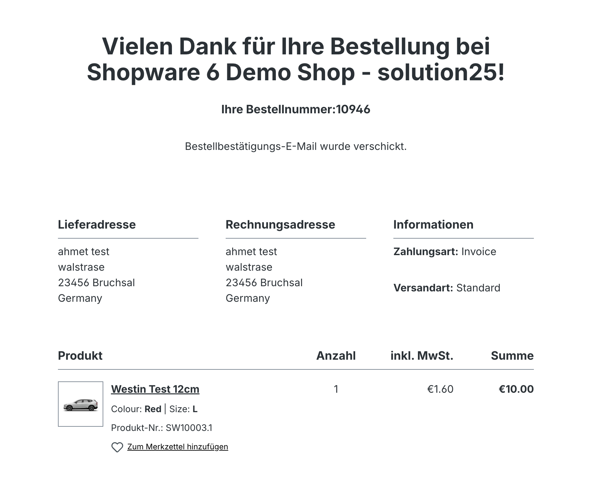

---

### TC-P-02 — Find a product through the search bar

| Field             | Value          |
| ----------------- | -------------- |
| **Priority**      | High           |
| **Preconditions** | Home page open |
| **Result**        | **Passed**     |

| #   | Step                                                                   | Expected result                                                |
| --- | ---------------------------------------------------------------------- | -------------------------------------------------------------- |
| 1   | Click the header search field (placeholder "Suchbegriff eingeben ...") | Input is focused                                               |
| 2   | Type a term matching an existing product, for example "Westin"         | A suggestion dropdown appears                                  |
| 3   | Press Enter                                                            | Results page loads at `/search` with at least one product tile |
| 4   | Click the first result                                                 | The product detail page for that exact product opens           |

**Observed:** Search returned the matching product and the correct detail page
opened.

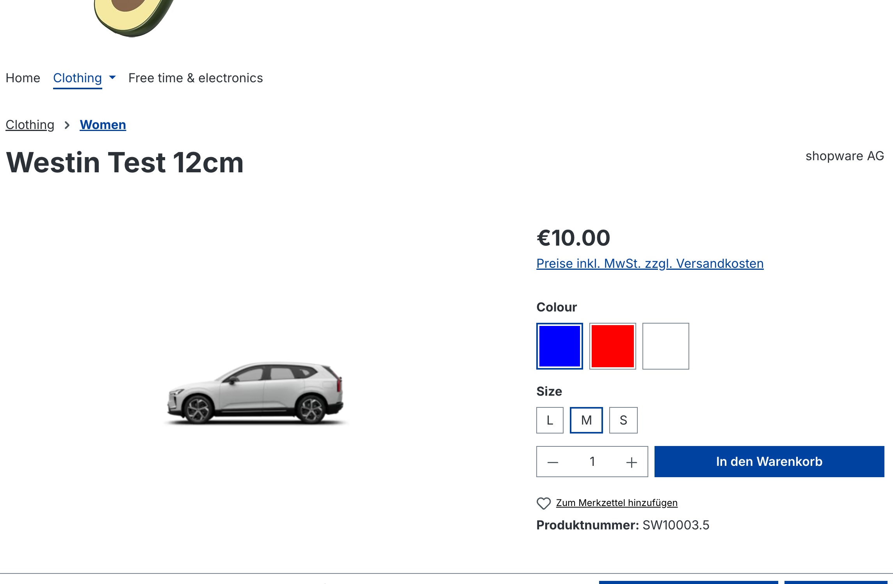

---

### TC-P-03 — Find a product through category navigation

| Field             | Value          |
| ----------------- | -------------- |
| **Priority**      | Medium         |
| **Preconditions** | Home page open |
| **Result**        | **Passed**     |

| #   | Step                                                                  | Expected result                                    |
| --- | --------------------------------------------------------------------- | -------------------------------------------------- |
| 1   | Open "Clothing" or "Free time & electronics" from the main navigation | Category listing page loads with a product grid    |
| 2   | Open a product from the listing                                       | Product detail page opens for the selected product |
| 3   | Add it to the cart                                                    | Off-canvas panel shows the product                 |

**Observed:** A product can be reached and added to the cart without using
search.

**Note:** The main navigation renders in English while the surrounding page is
German. Recorded as an observation, not a failure of this case.

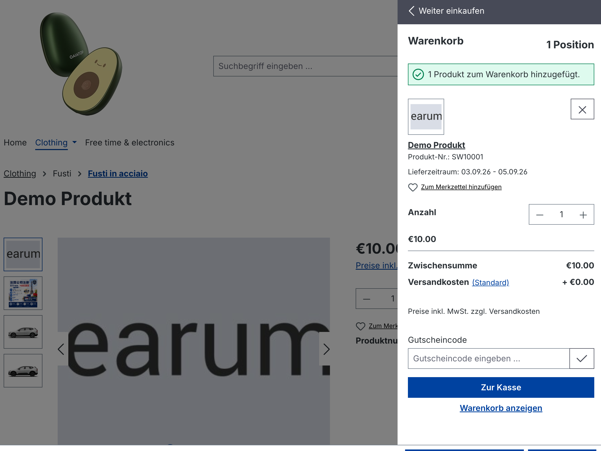

---

### TC-P-04 — Change quantity in the cart before checkout

| Field             | Value                   |
| ----------------- | ----------------------- |
| **Priority**      | High                    |
| **Preconditions** | One product in the cart |
| **Result**        | **Passed**              |

| #   | Step                                           | Expected result                                                                                        |
| --- | ---------------------------------------------- | ------------------------------------------------------------------------------------------------------ |
| 1   | Open `/checkout/cart`                          | Cart shows one line item, Anzahl 1, Stückpreis and Summe both €10.00                                   |
| 2   | Change Anzahl using the + control or by typing | Summe updates to match unit price multiplied by quantity                                               |
| 3   | Check the Zusammenfassung panel                | Zwischensumme and Gesamtsumme update accordingly, Versandkosten remains €0.00, VAT recalculates at 19% |

**Observed:** Quantity changes were reflected correctly in the line total and in
the summary panel.

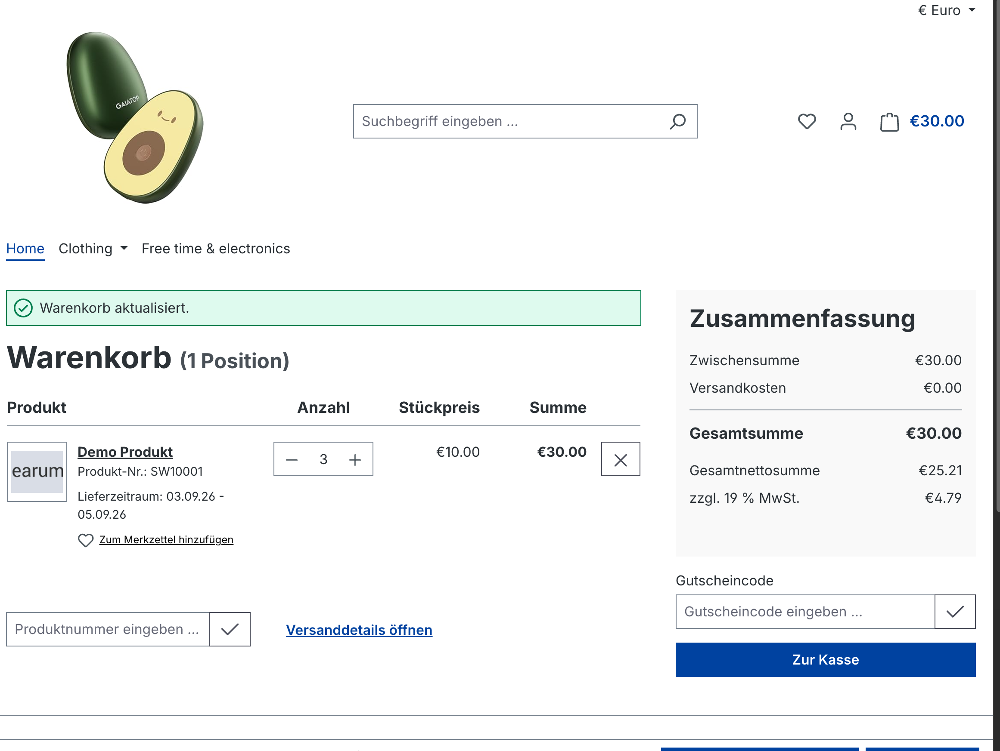

---

### TC-P-05 — Cart contents survive navigation

| Field             | Value      |
| ----------------- | ---------- |
| **Priority**      | Medium     |
| **Preconditions** | Cart empty |
| **Result**        | **Passed** |

| #   | Step                                               | Expected result                                             |
| --- | -------------------------------------------------- | ----------------------------------------------------------- |
| 1   | Add a product to the cart                          | The cart total in the header updates to the product price   |
| 2   | Navigate to the home page, then to a category page | The header cart total is unchanged on every page            |
| 3   | Reload the browser                                 | The header cart total is still unchanged                    |
| 4   | Open `/checkout/cart`                              | The same product is listed with the same quantity and price |

**Observed:** The guest cart persisted across navigation and survived a full
page reload within the session.

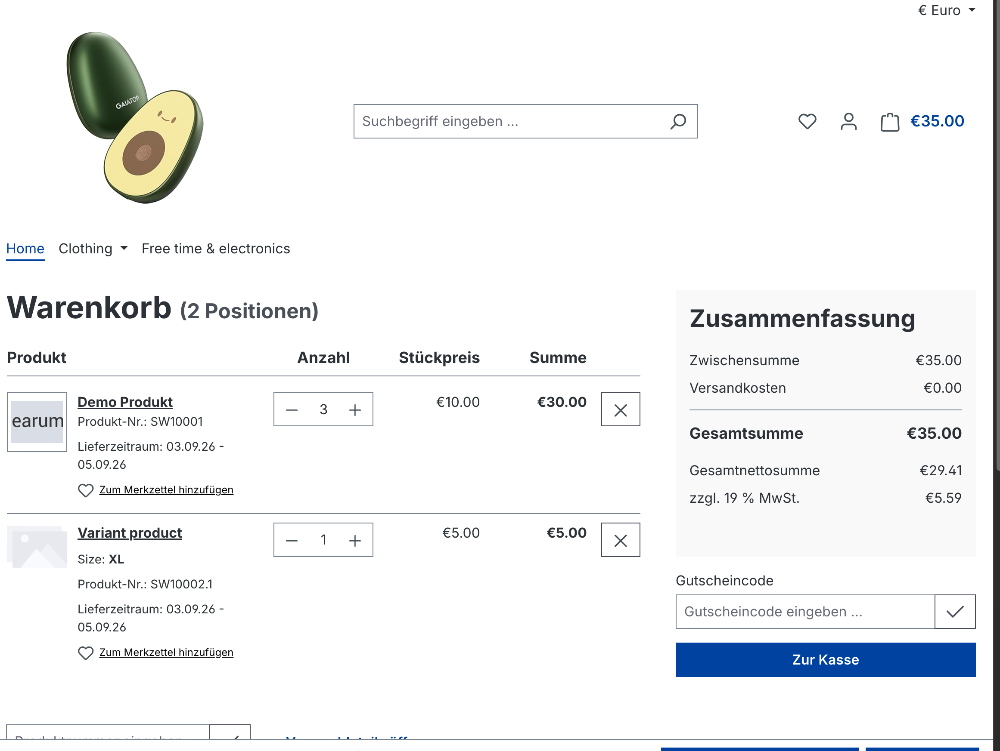

---

## Negative test cases

### TC-N-01 — Submit the guest form with required fields empty

| Field             | Value                                                                   |
| ----------------- | ----------------------------------------------------------------------- |
| **Priority**      | High                                                                    |
| **Preconditions** | One product in cart, checkout form open, "Kundenkonto anlegen" unticked |
| **Result**        | **Passed.** Also automated in `guest-checkout.cy.ts`                    |

| #   | Step                   | Expected result                                                                                                           |
| --- | ---------------------- | ------------------------------------------------------------------------------------------------------------------------- |
| 1   | Leave all fields blank | Form is empty                                                                                                             |
| 2   | Click "Weiter"         | Submission is blocked, the page stays on `/checkout/register`                                                             |
| 3   | Inspect the messages   | Every required field is outlined in red with an error icon and the message "Die Eingabe darf nicht leer sein." beneath it |

**Observed:** The order could not proceed and each missing field was identified.
Vorname, Nachname, E-Mail-Adresse, Straße und Hausnummer, PLZ and Ort each
showed the message. When "Kundenkonto anlegen" is left ticked, the Passwort
field additionally shows "Das Passwort muss mindestens 8 Zeichen lang sein."

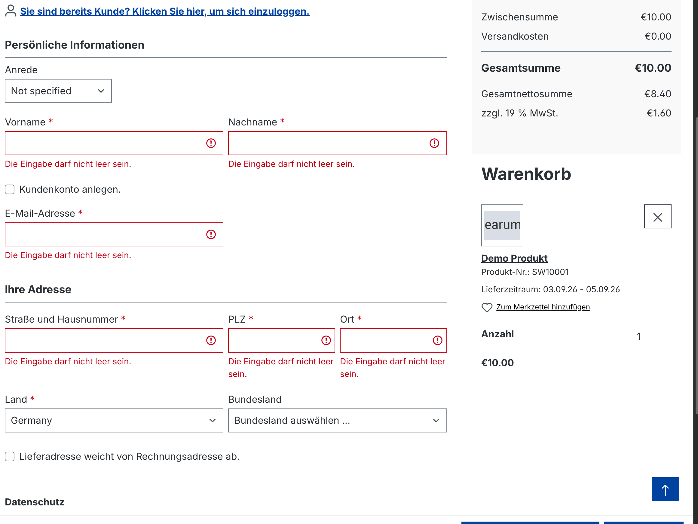

---

### TC-N-02 — Submit an invalid email address

| Field             | Value                                                           |
| ----------------- | --------------------------------------------------------------- |
| **Priority**      | High                                                            |
| **Preconditions** | One product in cart, checkout form open, all other fields valid |
| **Result**        | **Passed**                                                      |

| #   | Step                                                    | Expected result                                                                                 |
| --- | ------------------------------------------------------- | ----------------------------------------------------------------------------------------------- |
| 1   | Enter `ahmet.example.com` in E-Mail-Adresse (no @ sign) | Value is accepted into the field                                                                |
| 2   | Click "Weiter"                                          | Submission is blocked                                                                           |
| 3   | Read the message                                        | A message identifies the email field as invalid, and the other valid fields retain their values |

**Observed:** The malformed email was rejected and the remaining field values
were preserved, so the form did not have to be retyped.

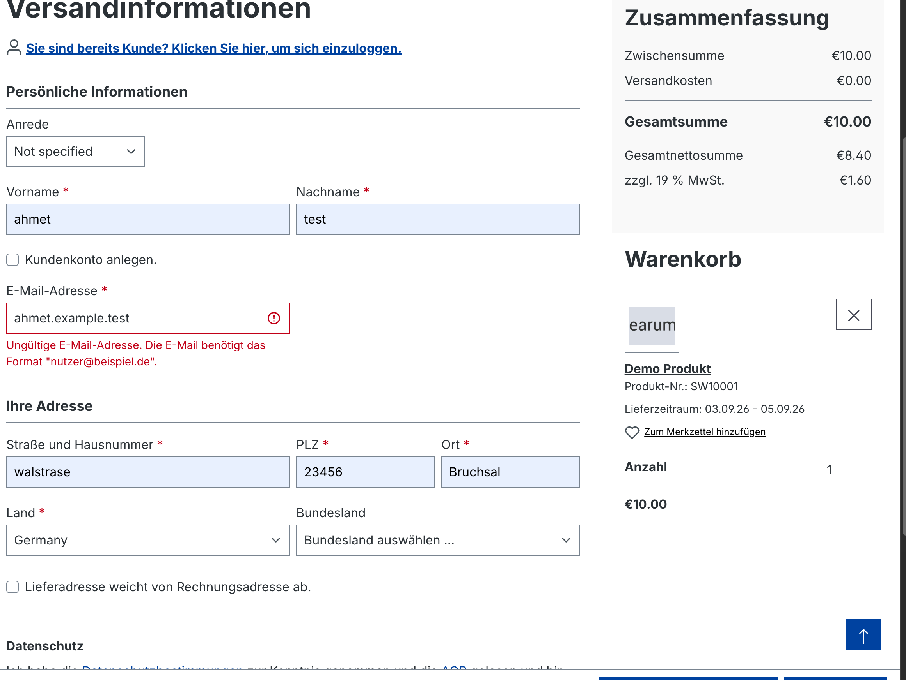

---

### TC-N-03 — Attempt to reach the confirmation step with an empty cart

| Field             | Value      |
| ----------------- | ---------- |
| **Priority**      | Medium     |
| **Preconditions** | Cart empty |
| **Result**        | **Passed** |

| #   | Step                                     | Expected result                                                           |
| --- | ---------------------------------------- | ------------------------------------------------------------------------- |
| 1   | Navigate directly to `/checkout/confirm` | The user is redirected away from the confirmation page                    |
| 2   | Observe the destination                  | The cart or home page is shown, with an indication that the cart is empty |
| 3   | Confirm no order was created             | No order number is generated                                              |

**Observed:** The confirmation step could not be reached with an empty cart,
including by entering the URL directly. No order was created.

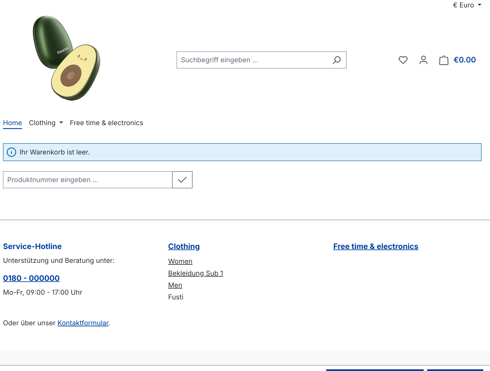

---

### TC-N-04 — Submit the order without accepting the AGB

| Field             | Value                                                                        |
| ----------------- | ---------------------------------------------------------------------------- |
| **Priority**      | High                                                                         |
| **Preconditions** | Guest details submitted, `/checkout/confirm` open, Cash on delivery selected |
| **Result**        | **Passed**                                                                   |

| #   | Step                                                                      | Expected result                                            |
| --- | ------------------------------------------------------------------------- | ---------------------------------------------------------- |
| 1   | Leave "Ich habe die AGB gelesen und bin mit ihnen einverstanden" unticked | Checkbox is unchecked                                      |
| 2   | Click "Zahlungspflichtig bestellen"                                       | Order is not placed, the page stays on `/checkout/confirm` |
| 3   | Read the message                                                          | A validation message points at the AGB checkbox            |

**Observed:** The order could not be submitted without accepting the terms.

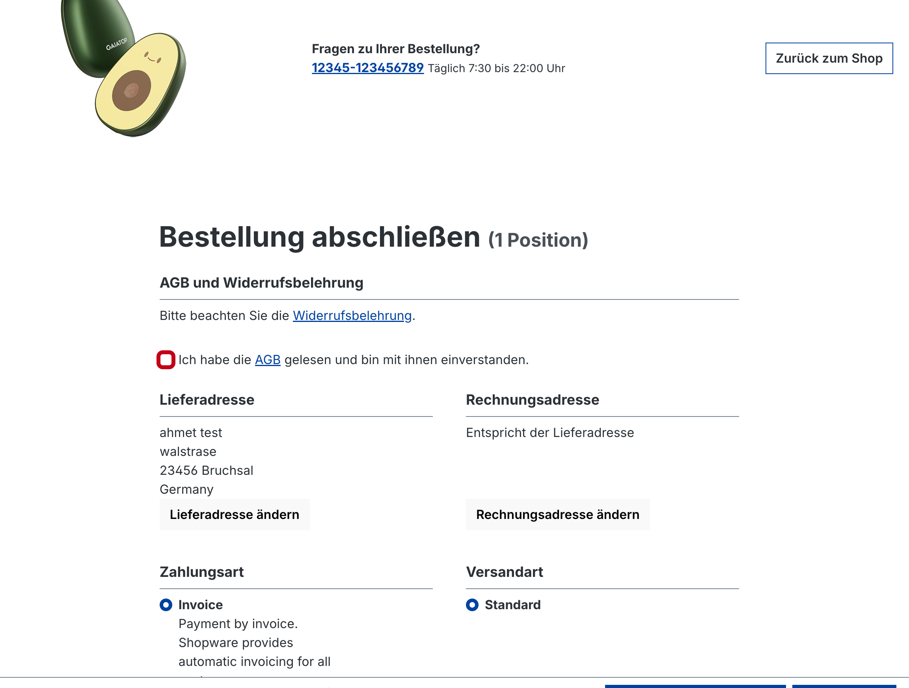

---

## Edge cases

### TC-E-01 — Invalid postcode and city format on a German address

| Field             | Value                                                 |
| ----------------- | ----------------------------------------------------- |
| **Priority**      | Medium                                                |
| **Preconditions** | One product in cart, checkout form open in guest mode |
| **Result**        | **FAILED. Raised as BUG-001**                         |

| #   | Step                                                 | Expected result                                                                 |
| --- | ---------------------------------------------------- | ------------------------------------------------------------------------------- |
| 1   | Fill all fields with valid data, Land set to Germany | Fields accept the input                                                         |
| 2   | Enter `321231` as PLZ (six digits)                   | The value should be rejected, since German postcodes are exactly five digits    |
| 3   | Enter an arbitrary string as Ort                     | Should be accepted as free text, but the postcode should still block submission |
| 4   | Click "Weiter" and attempt to complete the order     | Submission should be blocked at step 2                                          |

**Observed: FAILED.** No format validation is applied to the address fields.
Order 10902 was created with "321231 doqwndlqwd, Germany" as both the delivery
and billing address, and order 10903 with "321231 Bremen". Address fields are
validated for presence only, never for format. Raised as **BUG-001**.

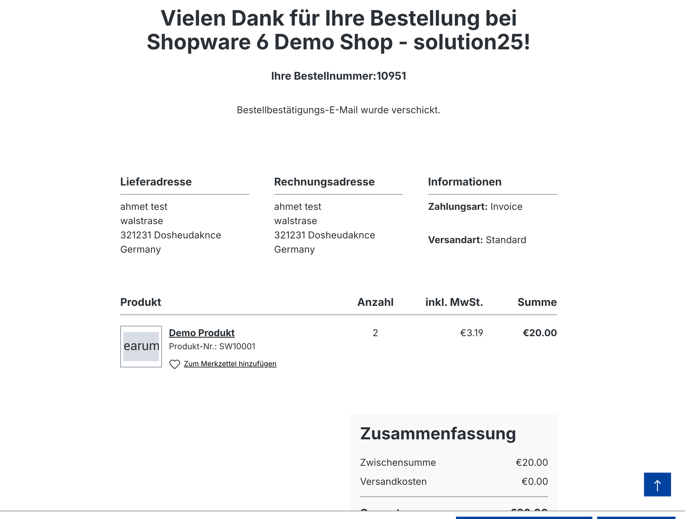

---

### TC-E-02 — Quantity below minimum and above maximum

| Field             | Value                                                              |
| ----------------- | ------------------------------------------------------------------ |
| **Priority**      | Medium                                                             |
| **Preconditions** | One product in the cart, `/checkout/cart` open                     |
| **Result**        | **Passed on behaviour, defect in presentation. Raised as BUG-002** |

| #   | Step                                         | Expected result                                                                   |
| --- | -------------------------------------------- | --------------------------------------------------------------------------------- |
| 1   | Set the Anzahl field to `0`                  | The value is rejected with a message. The cart must not show a line at quantity 0 |
| 2   | Set the Anzahl field to `9999999`            | The value is rejected or capped, with a message stating the limit                 |
| 3   | Check the Zusammenfassung after each attempt | Totals are unchanged and remain valid positive amounts                            |

**Observed:** Both values were correctly refused and the totals stayed at
€10.00, so no invalid quantity can reach an order. However the messages read
"Value must be greater than or equal to 1." and "Value must be less than or
equal to 100." in English on an otherwise German page. The field carries
`min="1" max="100" step="1"` with no custom validation message, so the text
falls back to the browser's own locale. Raised as **BUG-002**.

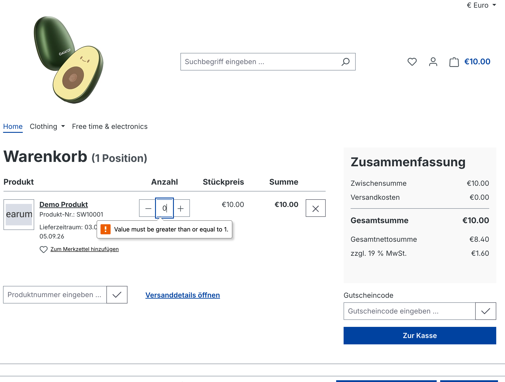

---

## Risks and notes

- The demo store is shared, so another tester's actions can change stock levels
  and cause intermittent results, particularly in TC-E-02 where the maximum
  quantity is 100.
- Order confirmation emails could not be verified, since there is no mailbox
  access on the shared instance. The finish page claims one was sent.
- Testing was performed on Chrome 152 only, at desktop width. Cross-browser and
  mobile viewport coverage would be the first extension of this plan, since
  mobile checkout is where most real e-commerce revenue is lost.
- Chrome's automatic translation must be disabled while testing this store.
  With it active, some strings are translated and others are not, which
  produces language inconsistencies that look like defects but are not. Two
  early observations were discarded for this reason.
